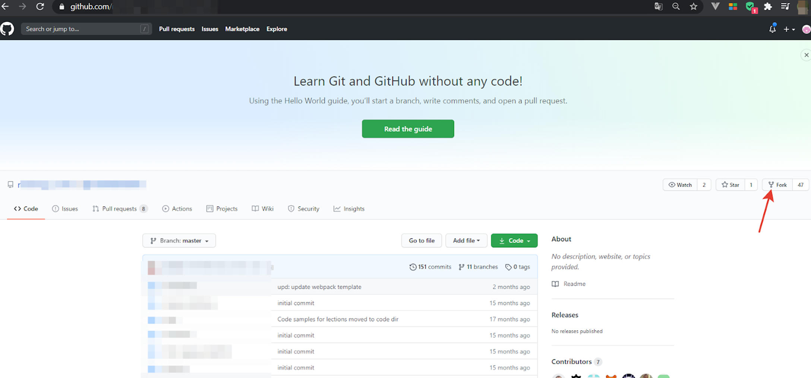

## Форк

**Форк** — собственный проект, основанный на другом проекте.

Важные возможности _fork_:

* Форк сохраняет связь с проектом-родителем, по которой он может получить изменения из проекта-родителя;
* Форк сохраняет связь с проектом-родителем, по которой он может передать изменения в проект-родитель. Это используется в модели ветвления Forking Workflow.

**Как создать fork**

На _GitHub_ форк создаётся с помощью кнопки «fork», которая расположена в интерфейсе при просмотре чужих проектов.

[< к содержанию](./readme.md) / [следующая](./послесловие.md)