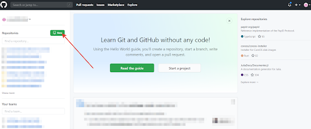

## Создание проекта на _GitHub

Чтобы создать рипозиторий на _GitHub_ - нажмите кнопку **New**.

Созданный рнпозиторий необходимо связать с проектом. Для этого следуйте советам _GitHub_.

[< к содержанию](readme.md) / [следующая](./Команды.md)