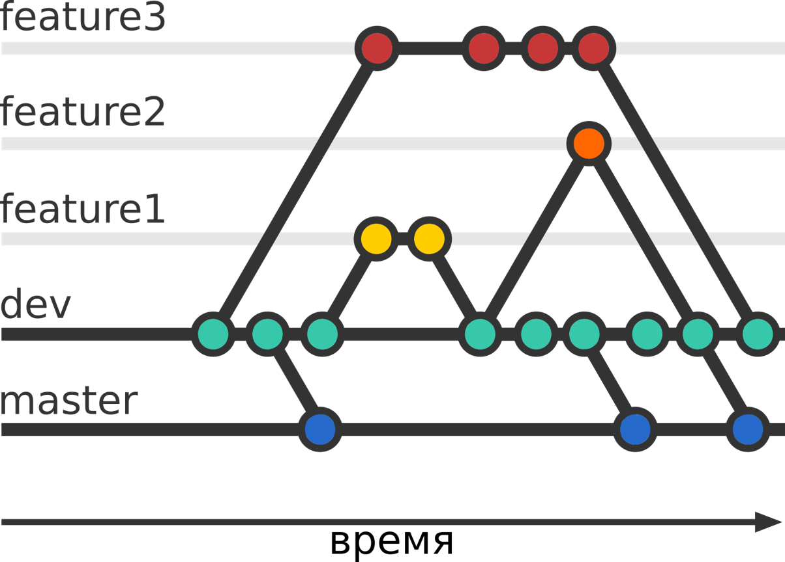

## Методологии ветвления

***Central Workflow***

Подходит для одиночного проекта.

***Developer Branch Workflow***

У каждого разработчика есть своя личная ветка или несколько, в которые он вносит изменения. Все изменения, опубликованные в удаленном репозитории будут в этой ветке. Вся работа может быть выполнена на разных ветках, но потом должна будет слита (_merged_) в одну главную ветвь.

***Feature Branch Workflow***

В этом случае репозиторий имеет второстепенную основную ветку (dev), в которой находится стабильный код для отправки пользователям. Фичи начинают свой код от этой ветки и сливаются с ней. Этот подход подходит командам, которые используют какой-то метод управления проектами.

***Issue Branch Workflow***

Очень похоже на Feature Branch Workflow, однако есть существенное отличие — ветки создаются по задачам, поставленным перед разработчиками, а не по фичам, а каждая фича может состоять из нескольких отдельных задач.

***Forking Workflow***

В рамках Forking Workflow стратегии разработка ведется так, что есть два репозитория:

* Оригинальный репозиторий, в который будут сливаться все изменения.

* Форк репозитория (это копия оригинального репозитория во владении другого разработчика, который хочет внести изменения в оригинальный).

***Gitflow***

[_Gitflow_](https://www.atlassian.com/ru/git/tutorials/comparing-workflows/gitflow-workflow) подходит для организации рабочего процесса на основе релизов.

[< к содержанию](./readme.md) / [следующая](./fork.md)